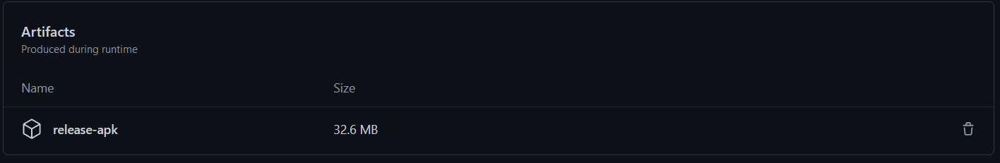

# Android Continues Deployment

Although Android deployment using GitAction can be done to the extent of deploying and app directly to production environment, it's highly discouraged to do so.

But we have developed a 3-stages deploy process depending on Git Actions.

1. Deploy to assets cache.
2. Deploy as a GitHub release.
3. Deploy as a Google Play draft.

And those are advised to work as follows.

## Artifacts

This can be considered as an internal build. this build is uploaded to the artifacts folder inside the build pipeline.

A big advantage of this build is that it can be deleted. And the artifact can be used in later build stages, for example if we wanted to create a Robo test in Firebase.

A big disadvantage however is that this build is for the development team. outsiders typically face problems when downloading this package. and another one is that the release download is unresumable.

## Release

This is a release that can be found in the repo home folder.

This is usually a convenient way to release a review copy of the app. note that this shows at the home page of the repo. It can be considered a release, although I recommend using the `pre-release` tag until we can get a finished version. and then creating a latest release only in the `dev-mobile`, `dev` and `master` branches.

The release download is resumable (in most of the cases) and follows the same visibility of the repo.

Note: This is the current way of delivery followed in Yes-Soft.

## Play Store Internal Test Release 

This is an internal release, deployed on Google Play. Usually we can specify an internal testing team list, and we release only to them. when it checks out, we can advance this release to the next stages like public beta and production full release. We recommend advancing the release manually for maximum confidence.