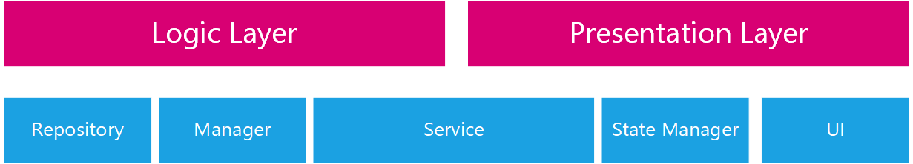

# Architecture 

Any module consists of 2 separated layers, the logic layer, and the presentation layer. this method can be used across many Cross-Platform environment like KMP and KMM and our platform Flutter.



As you can see we want to maximize the separation between those 2 layers.

What this means is that in order to create a new module we need to create the following folders

| Folder        | Function                                                     |
| ------------- | ------------------------------------------------------------ |
| repository    | Repository Classes                                           |
| manager       | Manager Classes                                              |
| response      | API responses model classes                                  |
| request       | API request model classes                                    |
| service       | Service Class                                                |
| state_manager | State Manager Classes                                        |
| model         | The data object used in the UI (Mapped using a mapper inside the service) |
| ui            | UI Classes                                                   |

And inside the UI folder we find

| Folder | Function                            |
| ------ | ----------------------------------- |
| widget | Container for Widgets               |
| screen | The navigation component            |
| states | The states that a screen could have |

At the root of the module folder we find 2 important classes, those are

| Class                 | Function                                                     |
| --------------------- | ------------------------------------------------------------ |
| `<ModuleName>_module` | A Screen Navigation Component (Explained in the `module_class.md` file) |
| `<moduleName>_routes` | A routing paths for the component                            |

using the method we are able to provide a module architecture that could be used almost universally.

Here is an example from the `AuthModule` folder tree from our codebase:

```
├───enums
├───exceptions
├───manager
│   └───auth_manager
├───model
├───presistance
├───repository
│   └───auth
├───request
│   ├───login_request
│   └───register_request
├───response
│   └───login_response
├───service
│   └───auth_service
├───state_manager
│   └───login_state_manager
└───ui
    ├───screen
    │   └───login_screen
    ├───states
    │   └───login_states
    └───widget
        ├───confirm_code_widget
        ├───email_password_login
        ├───email_password_register
        ├───phone_email_link_login
        └───phone_login
```

