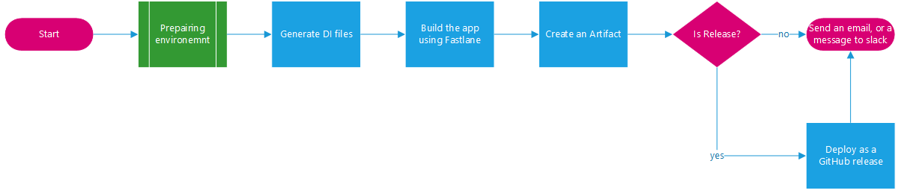
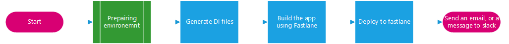

# Continues Deployment for Flutter Projects

This is a git action document, for flutter project. The goal is to make sure that the app reaches the client with minimal effort.

We will split this document into an outline (this document) and a workflow document.

## Android CD

Although Android deployment using GitAction can be done to the extent of deploying and app directly to production environment, it's highly discouraged to do so.

But we have developed a 3-stages deploy process depending on Git Actions.

1. Deploy to assets cache.
2. Deploy as a GitHub release.
3. Deploy as a Google Play draft.

And those are advised to work as follows.

you can see the differences between each one using 

[Android Continues Dep]: android-deploy.md	"Android Continues Deployment"

### Release Pipeline

This is done using the following pipeline that we will explain later in the workflow document.

## iOS CD

Although this can be done in 2 ways, we used only 1 of those. the process is time consuming and intensive.

<b>Note!!!!</b> if you don't have access to a MacOS stop now. you <b>must</b> have an access to xCode to make this pipeline works. at least at the early stages.

This can be fixed by deploying multiple workflows and automate the process, but I did not create it and I don't think it really worth the time. especially since most companies and firms work on 2-3 project an any given time. a work day to prepare the environment is not a lot of time.

### The Process

To create an iOS app from flutter first add fastlane to the project, and then get the dependencies file by running a `flutter build ios` command. note that this doesn't have to finish, as soon as the `Podfile` is created it should be enough.

After that we do a configuration which we will discuss in a later document. After that we produce a app on TestFlight. and lastly we sign the app using fastlane match.

Unfortunately, most of the job is done using a single step. it can be divided. But we haven't done so yet. splitting it may save 0-45 minutes of build time depending on the project.

Finally we upload the built IPA to TestFlight.

