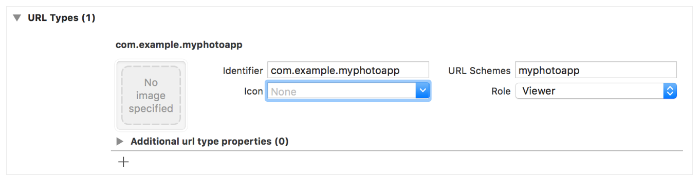

# Fastlane iOS

This is one of the more complicated scripts I will ever write in this wiki. To start we need to prepare the app for publishing.

It goes like:

1. Delete the `ios` folder and recreate it using `flutter create --org de.yes-soft .`
2. Download `Google-Services.plist` from Firebase.
3. Drag and Drop the file from the Downloads Folder into the Runner folder **IN THE XCODE WINDOW**
4. Create 2 new entitlements to the app, namely we usually need `Apple Push Notification` and `Sign in with Apple`
5. Open the Google-Services file, and copy the client reserved URL from it.
6. In Info Tab, Create new URL Type and paste it inside the URL schema past the client reserved URL. 

7. Go to the `Runner/info.plist` and add the Appropriate Permissions message. usually of them are located in the privacy section.
8. For now we will leave the singing automatic.

Now we have a functioning app, we should be able to test it using `flutter start` depending on the XCode project, we might need a `-d` flag.

Quick note: This app is deployable as-is to the apple store. we can start building and uploading from this stage.

## Automating the Upload  with Fastlane

to start we create a new file in the `ios` folder named `Gemfile` and in it we write:

```ruby
source "https://rubygems.org"

gem "fastlane"
```

next we install fastlane by

```sh
bundle install
```

After that we create a new folder named `fastlane`  and in it we create 3 files.

1. Appfile
2. Fastfile
3. Matchfile

Each of those have a very interesting job. Appfile contains info about the app. Fastfile says how to build it, and Matchfile says how to sign it.

```ruby
# Appfile
app_identifier("de.yes-soft.appName") #package id
apple_id("account@gmail.com") # owner email
itc_team_id("******") # App Store Connect Team ID
team_id("****") # Developer Portal Team ID
```

Those values can be found in other Yes Soft projects they are mostly the same for every app except of package Id.

Next Match File

```ruby
# Matchfile

git_url("git@github.com:yes-soft-de/private_repo_for_key.git") # Repo where we find signing certs
git_branch("branchy") # The branch the contains the repo key
storage_mode("git") # Same
app_identifier(["de.yes-soft.appName"]) # Package ID
username(ENV['FASTLANE_USER']) # User name.
```

Note, `Env` is provided via the GitHub Action, when building locally it's better to export the FASTLANE_USER before using it in this script.

Note 2: This is why we use SSH_PRIVATE_KEY in the CI, to pull secrets into the CI to be able to pull from the private repo using an ssh client.

and finally the Fastfile

```ruby
default_platform(:ios)
platform :ios do
  desc "Push a new beta build to TestFlight"
  lane :beta do
    if is_ci
      create_keychain(
        name: ENV['MATCH_KEYCHAIN_NAME'],
        password: ENV["MATCH_KEYCHAIN_PASSWORD"],
        default_keychain: true,
        unlock: true,
        timeout: 3600,
        lock_when_sleeps: false
      )
    end
    
    
    match(
      type: "appstore",
      readonly: is_ci,
      keychain_name: ENV['MATCH_KEYCHAIN_NAME'],
      keychain_password: ENV["MATCH_KEYCHAIN_PASSWORD"],
    )

    increment_build_number(
      build_number: ENV["GITHUB_RUN_NUMBER"]
    )

    build_app(
      workspace: "Runner.xcworkspace",
      scheme: "Runner",
      export_method: "app-store"
    )
    upload_to_testflight
  end
end

```

First we create the key chain, this is similar to key store in Android, using this portion of the script:

```ruby
if is_ci
      create_keychain(
        name: ENV['MATCH_KEYCHAIN_NAME'],
        password: ENV["MATCH_KEYCHAIN_PASSWORD"],
        default_keychain: true,
        unlock: true,
        timeout: 3600,
        lock_when_sleeps: false
      )
    end
```

Note the `is_ci` makes this portion only works on GitHub.

Next, we get the certificate:

```ruby
match(
      type: "appstore",
      readonly: is_ci,
      keychain_name: ENV['MATCH_KEYCHAIN_NAME'],
      keychain_password: ENV["MATCH_KEYCHAIN_PASSWORD"],
    )
```

Note here that we are using the type `appstore`, this is because we are using transported and direct TestFlight. if we are using Firebase Distribution we would use `adhoc` instead.

Next we set the build number using

```ruby
increment_build_number(
      build_number: ENV["GITHUB_RUN_NUMBER"]
    )
```

What this does is synchronizing the iOS build number with the app version. this ensures that the app always increments it's build number, making sure that there is always a free slot for the app to be uploaded to.

A better solution would be to:

1. Either link the Flutter package build number to the GitHub Run Number
2. increase the version manually from flutter (can get a bit tidies)

But for now it's has worked for us. and frankly I don't think that it's that bad in the current state.

Next we build the actual IPA using

```ruby
build_app(
      workspace: "Runner.xcworkspace",
      scheme: "Runner",
      export_method: "app-store"
    )
```

Again, the export method should be similar to the one used in the Matchfile.

After that we simply upload the file to TestFlight. we can skip the waiting but I like to make sure that the app actually show up. we can upload using

```ruby
upload_to_testflight
```

Now, that we automated everything we need to prepare our app to be signed by the repo. as you can notice, we haven't uploaded the certificates yet.

we can do that by doing 2 things, first we produce a new project in TestFlight using:

```sh
fastlane produce
```

And then we create a new certificates using

```sh
fastlane match appstore
```

If we wanted Firebase Distribution we would use `Adhoc`, keep that in mind!

After a couple of 2FAs we set the password, <b>This password is the one used in the action, So keep it safe and remembered</b>

After  that we close XCode and reopen it. we go to the project, and we change the signing config to manual, and we sign using the created certificates. the process is heavily automated and doesn't take long.

After we do this, we create the GitHub Action workfile and we create a new session by executing:

```sh
fastlane spaceauth
```

After that, we paste the session into FASTLANE_SESSION in GitHub secrets.

Finally we push to the project.

Note, to optimize the build time, we can do:

1. Clean the project
2. Add `pod 'FirebaseFirestore', :git => 'https://github.com/invertase/firestore-ios-sdk-frameworks.git', :tag => '6.26.0'` to the `Podfile`
3. Start the project in the simulator
4. When it runs it's ready, we can deploy the changes and we shall be OK.

```sh
Before:    ~ 551s
After:     ~ 174s
```

This is for Firebase Alone, when compiling flutter GitHub CI can easily eat into 35 minutes to finish building the project another 20 minutes to upload and for TestFlight to finish processing.
