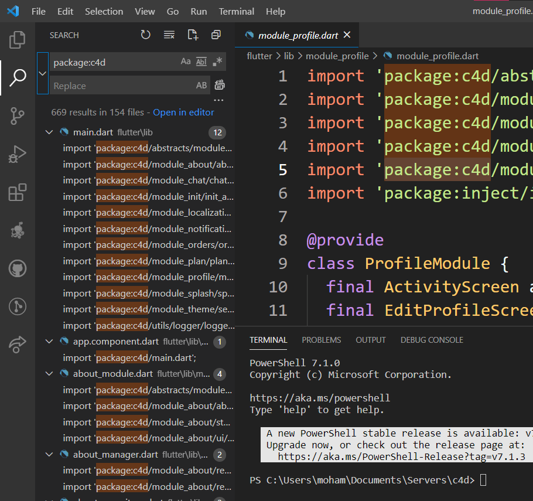

# Creating New Apps

To start of with a new project/app we follow these steps. There are many many variables to change if we forked the original projects, and it's not that easy to debug those. this is why will use the following strategy.

## Creating new project

create the project using

```
flutter create <project name>
```

## Adding the libs

we simply copy the content from the skeleton's lib folder into our new project folder

## Renaming Package

Then we use VS Code built in search and replace settings to change the package name in all the lib folder.



## Adding dependencies

Finally, we copy the dependencies from the boilerplate `pubspec.yaml` into the new project.

Voilà, You have a working project.

## Preparing   for release

[Android Deploy]: ./android-deploy.md	"Android Deploy"
[iOS Deploy]: ./ios-deploy.md	"iOS Deploy"

